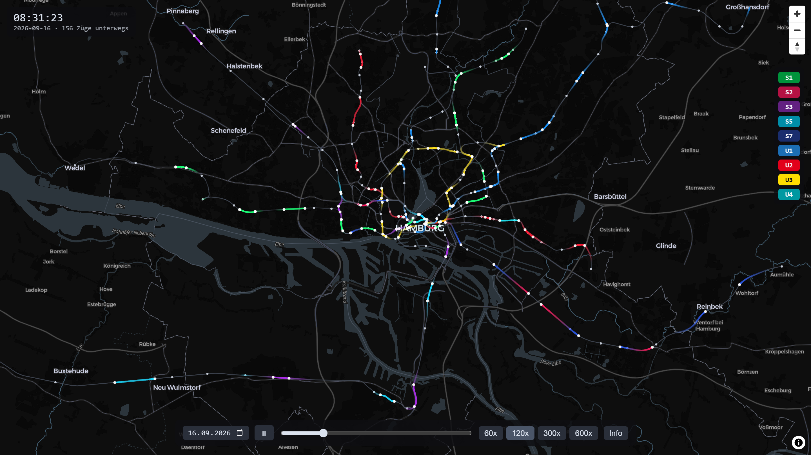
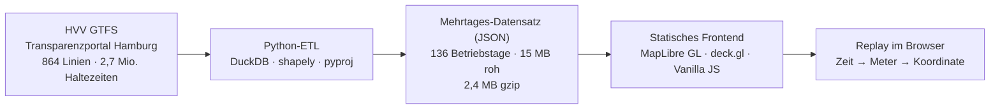

# RailFlow

**Ein kompletter Betriebstag des Hamburger U- und S-Bahn-Netzes im Zeitraffer.**
Echte Fahrpläne, echte Gleisgeometrien, jede Bahn ein leuchtender Punkt mit Nachleuchtspur.

**➜ Live-Demo: https://gradientd3scent.github.io/railflow/**



> **TL;DR (English):** RailFlow replays a full day of Hamburg's rapid transit network
> (U-Bahn + S-Bahn) as a time-lapse on a dark map. A Python ETL bakes open GTFS data
> into a single compact file covering 136 service days (15,339 trips, 2.4 MB gzipped);
> a dependency-light frontend (MapLibre GL + deck.gl, vanilla JS) interpolates every
> train position on the fly: time → track meters → coordinates. It is a replay of
> published schedules, not a simulation. Pick any day, filter lines, scrub through
> the day at up to 600x.

## Was es zeigt

- **136 wählbare Betriebstage** (kompletter Fahrplanzeitraum des GTFS-Feeds) über einen Datums-Picker, Tageswechsel ohne Nachladen
- **15.339 Fahrten** auf 9 Linien (U1 bis U4, S1, S2, S3, S5, S7), zur Rushhour über 150 Züge gleichzeitig
- **Nachleuchtspuren in den offiziellen Linienfarben**, das statische Netz bleibt bewusst grau: die Farbe trägt die Bewegung
- **Zeitregler, Play/Pause, Zeitraffer** 60x bis 600x, Linienfilter, Betriebstag von 04:00 bis ins Nachtprogramm nach Mitternacht
- Läuft als **rein statische Seite**, keine Server, keine APIs zur Laufzeit

Wichtig zur Einordnung: RailFlow ist ein **Replay veröffentlichter Fahrpläne**, keine Simulation.
Nichts kann abweichen oder emergieren; der modellhafte Anteil ist die Interpolation der
Positionen zwischen den Halten (konstante Geschwindigkeit, Stillstand an Stationen).

## Architektur: Daten backen statt streamen



Die ETL läuft einmal pro Feed-Update und backt alles Nötige in eine Datei:
Geometrien mit kumulierten Streckenmetern (berechnet in UTM 32N), Fahrten mit
Haltezeiten als Sekunden seit Betriebstagesbeginn (04:00), ein Kalenderblock
ordnet jedem Datum seine Fahrten zu. Der Trick hinter "136 Tage in 2,4 MB":
Die Tage sind zu ~95 % redundant, jede Fahrt wird nur einmal gespeichert,
die Tagesauswahl ist ein Kalender-Lookup im Client.

### Das Herzstück: Interpolation

Positionen stehen nirgends in den Daten, sie werden berechnet:

```
position(fahrt, t):
  Zeit  → Meter:      linear zwischen den umgebenden Halten,
                      in Haltezeiten steht der Zug
  Meter → Koordinate: binäre Suche in der kumulierten Meter-Liste
                      des Shapes, linear zwischen den Punkten
```

Die Referenz-Implementierung lebt in Python (`pipeline/interpolation.py`), der
JS-Port (`frontend/src/interpolation.js`) wird mit identischen, handgerechneten
Testfällen gegen sie verifiziert. Fürs Rendering übersetzt ein Konverter jede
Fahrt in Vertex-Zeitstempel für den deck.gl-TripsLayer (GPU interpoliert die
Spuren), die weißen Zugpunkte rechnet weiterhin die eigene Interpolation, und
ein Äquivalenz-Test beweist, dass beide Wege dieselben Positionen liefern.

Beim Zuordnen der Halte zur Geometrie gilt **Vorwärts-Snapping**: Jede Station
wird nur auf dem Streckenrest ab dem vorherigen Halt gesucht. Ohne das springt
auf dem U3-Ring (Barmbek kommt zweimal vor) die Position zurück auf Kilometer null.

## Lieblings-Fundstücke aus den Daten

Open Data heißt nicht saubere Daten. Eine Auswahl der Detektivfälle, die dieses
Projekt lösen musste:

1. **Die 264-km/h-Geisterstationen.** Zehn Stops tragen Nummern statt Namen
   ("349000") und ließen Züge rechnerisch mit 264 km/h fahren. Des Rätsels
   Lösung: Es sind gar keine Stationen, sondern Durchfahrts-Betriebspunkte an
   der Landesgrenze (`pickup_type = drop_off_type = 1`), die Fahrplan-Pufferzeit
   tragen. Aufgeflogen durch eine Geschwindigkeits-Plausibilitätsprüfung in den Tests.
2. **`parent_station` ist leer.** Die GTFS-Standardmethode, Gleise zu Stationen
   zu gruppieren, fällt im Feed komplett aus. Stattdessen werden Stationen über
   die IFOPT-Struktur der Stop-IDs gebildet (die ersten drei DHID-Segmente),
   plus Merge für Pseudo-Duplikate wie "Barmbek(2)", 14 m neben Barmbek.
3. **Stop-Koordinaten sind linienabhängig genau.** U-Bahn-Stops liegen unter
   3 m an der Gleisachse, S-Bahn-Stops bis 20 m daneben, und am Berliner Tor
   referenzieren S2/S7 eine 86 m entfernte Bahnsteiggruppe. Die Snapping-Toleranz
   musste entsprechend kalibriert werden, abgesichert durch Monotonie- und
   Tempo-Invarianten im Validator.
4. **Nachtfahrten, zwei Codierungen.** 99 Fahrten nutzen sauber GTFS-Zeiten über
   24:00 (z. B. 25:36), vier stehen mit echten Kalendertag-Zeiten im falschen
   Servicetag. Der Betriebstag umfasst deshalb alle Fahrten seines Servicetags,
   vereinzelt mit negativen Sekunden vor 04:00.

## Selbst ausführen

Das Frontend läuft ohne weitere Vorbereitung, der gebackene Datensatz liegt im Repo:

```bash
cd frontend
npm install
npm run dev        # http://localhost:5173
npm test           # Interpolations- und Konverter-Tests (node --test)
```

Die Pipeline braucht Python 3.11+ und die GTFS-Rohdaten (nicht im Repo, ~40 MB ZIP):

```bash
python -m venv .venv && .venv/Scripts/pip install -r pipeline/requirements.txt

# HVV-GTFS vom Transparenzportal Hamburg laden (Suche: "HVV Fahrplandaten GTFS"),
# ZIP nach data/ entpacken und die .txt-Dateien in .csv umbenennen

.venv/Scripts/python pipeline/erzeuge_mehrtagesdatensatz.py --frontend
.venv/Scripts/python pipeline/pruefe_tagesdatensatz.py data/mehrtagesdatensatz.json
```

`pruefe_tagesdatensatz.py` validiert jeden gebackenen Datensatz gegen fachliche
Invarianten (Meter-Monotonie, Zeitkonsistenz, Plausibilitäts-Tempolimit).
`frontend/tests/geraete_sweep.mjs` prüft das Layout zusätzlich auf 12
Standard-Geräten von 320-px-Phones bis Desktop (Playwright, Aufruf im Skriptkopf).

## Repo-Struktur

```
pipeline/   Python-ETL: GTFS → Mehrtages-Datensatz, Validierung, Interpolations-Referenz
frontend/   Vite + Vanilla JS: Karte, Replay-Engine, Interpolation, Tests
data/       GTFS-Rohdaten und ETL-Ausgaben (gitignored)
docs/       Screenshots
```

## Ausblick

Replay und Live-Betrieb teilen sich dieselbe Abspiellogik, Live heißt nur "t ist
jetzt": Mit Zugang zur Geofox-API des HVV (Echtzeitdaten inkl. Verspätungen)
würde aus dem Replay eine Live-Ansicht. Danach wird es erst richtig interessant:
What-if-Szenarien ("was passiert mit den Anschlüssen, wenn die S1 zehn Minuten
Verspätung hat") würden aus dem Replay eine echte Simulation machen.

## Daten & Lizenzen

- **Code:** [MIT](LICENSE)
- **Fahrplandaten:** HVV GTFS via [Transparenzportal Hamburg](https://transparenz.hamburg.de),
  [CC BY 4.0](https://creativecommons.org/licenses/by/4.0/). Die gebackenen
  Datensätze in `frontend/public/geo/` sind daraus abgeleitet.
- **Verwaltungsgrenzen:** Freie und Hansestadt Hamburg, Landesbetrieb Geoinformation
  und Vermessung, [dl-de/by-2-0](https://www.govdata.de/dl-de/by-2-0)
- **Basiskarte:** © [CARTO](https://carto.com/), © [OpenStreetMap](https://www.openstreetmap.org/copyright) contributors

RailFlow ist ein privates Portfolio-Projekt und steht in keiner Verbindung zum HVV.
